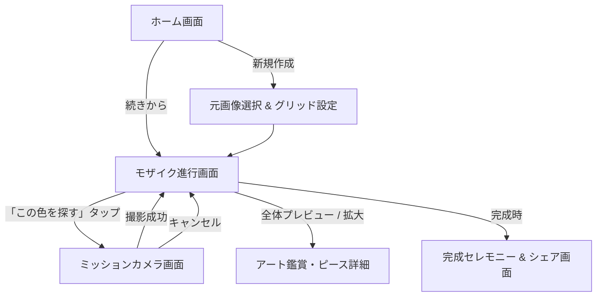

# アプリ設計書・機能仕様書

## 📱 アプリ名（仮称）: **ChromaHunt / 色集めモザイク（仮）**
**〜 日常の景色から色を集めて創る、体験型モザイクアートアプリ 〜**

---

## 1. 企画・コンセプト概要

### 1.1 コンセプト
ユーザーが選んだお気に入りの画像をベースに、**「写真ライブラリの写真」＋「現実世界で新たに撮影した写真」**をピースにして組み上げる新感覚の体験型モザイクアート作成アプリ。

単なる自動生成ツールではなく、**「足りない色を日常の中から探して撮影する（スカベンジャーハント）」というゲーミフィケーション**を融合させることで、日常の風景がすべてアートの素材に変わるワクワク感と、完成時の圧倒的な達成感を提供します。

### 1.2 主なターゲット & ユースケース
- **一般ユーザー**: 旅行の思い出写真、ペット、子供の写真で特別な1枚を作りたい。
- **お散歩・日常の遊び**: 「青いものを3枚探そう」など、子供や友達と一緒に楽しむ色探しゲーム。
- **イベント・記念日**: 友達同士で色を分担して撮影し、プレゼントとして1枚のアートを完成させる。

---

## 2. プレイモード設計

| モード名 | 説明 | 想定難易度 |
| :--- | :--- | :--- |
| **ハイブリッドモード**<br>*(標準)* | 写真ライブラリから自動で写真を当てはめ、**どうしても足りない色（数枚〜十数枚）だけを撮影ミッションとして発注**する。 | ★☆☆〜★★☆<br>(手軽に達成感を味わえる) |
| **完全ハントモード**<br>*(スカベンジャー)* | 写真ライブラリは使用せず、**全マス（例: 10×10=100マス）をゼロからカメラで撮影して集める**。 | ★★★<br>(じっくり遊ぶ本格派) |
| **テーマ縛りモード**<br>*(上級・オプション)* | 「食べ物」「植物」「身の回りの文具」など、特定の被写体だけで色を集めてモザイクを完成させる。 | ★★★☆<br>(クリエイティブな挑戦) |

---

## 3. システムアーキテクチャ & 技術スタック

### 3.1 技術スタック
- **プラットフォーム**: iOS 17.0+ (iPhone専用 / iPad対応)
- **UIフレームワーク**: SwiftUI + Swift Concurrency (async/await, Actor)
- **画像処理・カラー解析**:
  - `Core Image` / `Core Graphics` (画像リサイズ、クロップ、フィルタ)
  - `Accelerate (vImage)` (高速ピクセル演算・平均色/ヒストグラム算出)
  - `Photos` (`PHPhotoLibrary` による写真ライブラリの非同期スキャン & サムネイル取得)
- **カメラ・リアルタイム判定**:
  - `AVFoundation` (`AVCaptureSession`, `AVCaptureVideoDataOutput`)
- **データ永続化**:
  - `SwiftData` または `UserDefaults` + 軽量キャッシュディレクトリ（プロジェクトデータ、解析済み色インデックスの保存）

---

## 4. コア機能詳細仕様

### 4.1 ターゲット画像の選択とグリッド分割
1. ユーザーがターゲットとなる「元画像」をライブラリから選択または撮影。
2. グリッドサイズ（分割数）を選択:
   - **かんたん**: 10 × 10 (計 100ピース)
   - **標準**: 20 × 20 (計 400ピース)
   - **細密**: 30 × 30 〜 50 × 50 (900 〜 2,500ピース)
3. ターゲット画像を各マス（セル）に分割し、各セルの**代表色（平均Lab値）**を算出。

```
[元画像] ──(グリッド分割)──> [セル (x, y)] ──(色解析)──> ターゲットカラー配列 [L*, a*, b*]
```

---

### 4.2 色解析 & マッチングアルゴリズム

#### ① 色空間の選定（CIELAB色空間）
- 一般的なRGB色空間でのユークリッド距離は人間の知覚とズレが大きいため、**人の目の知覚に合わせた「CIELAB（$L^*, a^*, b^*$）色空間」**を採用。
- 明度（$L^*$）、赤-緑（$a^*$）、黄-青（$b^*$）に基づく色差計算（$\Delta E$）を使用。

$$\Delta E = \sqrt{(\Delta L^*)^2 + (\Delta a^*)^2 + (\Delta b^*)^2}$$

#### ② 写真ライブラリの事前スキャン & インデックス化
- 大量写真（数千枚）をそのまま処理するとメモリが枯渇するため、**64×64pxの極小サムネイル**のみを非同期で順次取得。
- 各写真の「画像ID（localIdentifier）」と「平均Lab値」をペアにした**カラーインデックス（軽量キャッシュ）**を構築。
- 近傍探索（KD-Treeまたはソート済みインデックス）でターゲット色に最も近い写真を高速検索。

---

### 4.3 不足色判定 & ミッション発行システム

1. **充足判定**:
   - 各セルに対し、ライブラリ内のベストマッチ写真との色差 $\Delta E$ を算出。
   - $\Delta E \le \text{許容閾値}$（例: $\Delta E \le 12$） $\rightarrow$ **配置確定（クリア）**
   - $\Delta E > \text{許容閾値}$ $\rightarrow$ **不足色（ミッション対象）**
2. **ミッションのクラスタリング（まとめ表示）**:
   - 不足しているセルが複数ある場合、似た色同士をグループ化（例:「鮮やかな水色 × 3マス」「深紅 × 2マス」など）。
   - 「いま探すべき色パレット」としてUIに一覧表示。

---

### 4.4 カメラ撮影 & リアルタイム判定システム

1. **リアルタイム・カラーサークル / ファインダーUI**:
   - カメラプレビュー画面中央に「判定サークル（レティクル）」を表示。
   - カメラ映像から中央領域の平均色をリアルタイムに抽出（30fps）。
2. **一致度ゲージ演出**:
   - 探している「目標色」と「今カメラに映っている色」の $\Delta E$ をリアルタイム計算。
   - 一致度（0%〜100%）をゲージや色変化で視覚的にフィードバック。
   - **85%以上（合格ライン）になると枠がグリーンに光り「OK! シャッターを押そう」と誘導**。
3. **撮影確定 & ピース嵌め込み演出**:
   - 撮影完了後、合格ならモザイクアート画面へ遷移し、該当セルに「カチャッ！」とピースがハマる心地よいアニメーション & SEを再生。
   - 不合格の場合は「もう少し明るい場所で撮ってみよう」「黄色味が足りないかも」などのアドバイスを表示。

```
[カメラ起動] ──> [中央領域のリアルタイムLab抽出] 
                 │
                 ├──(目標色と比較: ΔE計算) ──> [一致度ゲージ 0%〜100% 更新]
                 │
                 └──[シャッター押下] ──> [合否判定] ──OK──> [モザイクにカチャッと嵌る！]
                                                      └──NG──> [ヒント表示 & 撮り直し]
```

---

### 4.5 モザイクアートのレンダリング & 書き出し

- **編集画面**:
  - 全体像のプレビュー（ピンチイン/アウトで各マスの写真を拡大鑑賞可能）。
  - 各マスをタップすると「そのマスに使われた元写真」のフル表示が可能。
- **エクスポート機能**:
  - 高解像度画像（4K相当〜ポスター印刷可能サイズ）として1枚の画像にレンダリングして保存。
  - 「作成タイムラプス（集めたピースが順番に埋まっていく動画）」のSNSシェア機能（オプション）。

---

## 5. UI/UX 画面設計 & 画面遷移



### 主要画面構成
1. **ホーム画面**:
   - 「新しく作る」「保存した作品一覧」「作成中のプロジェクト」
2. **プロジェクト設定画面**:
   - 元画像プレビュー、グリッドサイズ選択（10x10, 20x20等）、モード選択（ハイブリッド / 完全ハント）
3. **モザイク進行・ワークスペース画面（メイン画面）**:
   - 上部: モザイク全体の進捗状況（例: `342 / 400 ピース (85%)`）
   - 中央: モザイクキャンバス（未達成のマスはグレーアウトまたは点滅表示）
   - 下部: 「次に探す色ミッション」カードカルーセル + 「カメラを起動して探す」ボタン
4. **ミッションカメラ画面**:
   - フルスクリーンカメラプレビュー
   - 中央: ターゲットカラーのリング（目標色と現在色を半々で比較表示）
   - 下部: 一致度メーター、撮影ボタン、戻るボタン

---

## 6. データモデル設計（SwiftData / Struct）

```swift
// プロジェクトデータ
struct MosaicProject: Identifiable, Codable {
    let id: UUID
    var title: String
    var createdAt: Date
    var targetImageData: Data       // 元画像
    var gridWidth: Int              // 横マス数 (例: 20)
    var gridHeight: Int             // 縦マス数 (例: 20)
    var mode: GameMode              // .hybrid / .fullHunt
    var tiles: [MosaicTile]         // 全マスの状態
    var isCompleted: Bool
}

// 1マス（タイル）の情報
struct MosaicTile: Identifiable, Codable {
    let id: UUID
    let gridX: Int
    let gridY: Int
    let targetLabColor: LabColor    // 目標色 (L, a, b)
    var placedPhotoId: String?      // はまった写真のIDまたはファイルパス
    var placedLabColor: LabColor?   // はまった写真の実測色
    var isLocked: Bool              // 配置完了フラグ
}

// CIELAB色モデル
struct LabColor: Codable, Equatable {
    let l: Float // 0...100 (明度)
    let a: Float // -128...127 (緑〜赤)
    let b: Float // -128...127 (青〜黄)
    
    // 色差 (ΔE) 計算
    func distance(to other: LabColor) -> Float {
        let dl = self.l - other.l
        let da = self.a - other.a
        let db = self.b - other.b
        return sqrt(dl*dl + da*da + db*db)
    }
}
```

---

## 7. 開発フェーズ・ロードマップ

| フェーズ | 開発内容 | ゴール・検証項目 |
| :--- | :--- | :--- |
| **Phase 1**<br>*(基盤ロジック)* | - 画像のグリッド分割 & Lab色抽出ロジック<br>- 色差（$\Delta E$）マッチングエンジンの構築 | テスト画像から正しく色分析とモザイク合成ができること |
| **Phase 2**<br>*(ライブラリ解析)* | - `PHPhotoLibrary` からの非同期サムネイル取得<br>- 高速インデックス作成とキャッシュ管理 | 数百〜数千枚の写真があっても数秒でマッチング完了すること |
| **Phase 3**<br>*(カメラ＆ミッション)* | - AVFoundationリアルタイムカメラプレビュー<br>- ROI中央領域の色解析 & 一致度判定UI | カメラで目標の色を狙って撮影・合格判定ができること |
| **Phase 4**<br>*(UI/UX・演出)* | - SwiftUIによるメイン画面・進行状況UI<br>- ピースがカチャッとはまるアニメーション・SE<br>- 高解像度書き出し機能 | 一連のゲームループ（設定→不足色特定→撮影→完成）が滑らかに動くこと |

---

## 8. 非機能要件・注意すべき課題と対策

1. **メモリ消費とクラッシュ対策**:
   - 写真ライブラリの画像やカメラの高解像度フレームをそのままメモリに載せ続けると即座にOOM（メモリ不足クラッシュ）が発生します。
   - **対策**: 解析用には極小サイズ（32〜64px）を使い、レンダリング時も必要最小限のサムネイルをタイル描画。書き出し時のみバックグラウンドで高解像度合成を実施。
2. **色判定の難しさ（照明・ホワイトバランスの影響）**:
   - 屋内と屋外、照明の色温度（電球色・蛍光灯）によって同じ物でもカメラに映る色が大きく変化します。
   - **対策**: 厳密すぎる判定にせず、許容幅（$\Delta E$ のしきい値）に少し遊びを持たせる、またはユーザーが難易度（イージー/ノーマル/プロ）を調整できるように設計。
3. **プライバシーと権限**:
   - `NSCameraUsageDescription` (カメラアクセス)
   - `NSPhotoLibraryUsageDescription` (写真ライブラリアクセス)
   - ユーザーへ「写真の解析は端末内のみで行われ、外部サーバーには一切送信されない」旨を明記して安心感を提供。
