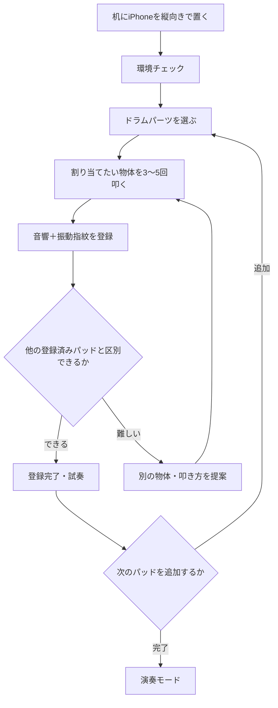
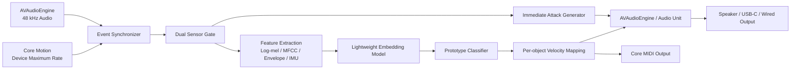

# どこでもドラム

## プロダクト企画書・技術設計・実装ロードマップ

**文書バージョン:** 0.1  
**想定プラットフォーム:** iPhone / iOS  
**プロダクト種別:** AIパーカッション、音楽制作、フィジカル・インターフェース  
**開発方針:** まず物理的成立性を検証し、測定結果に基づいて対応機種・パッド数・遅延目標を確定する

---

## 1. エグゼクティブサマリー

どこでもドラムは、iPhoneを置いた机と、その周囲にある日用品を、演奏可能な電子パーカッションへ変えるiPhoneアプリである。

ユーザーはコーヒーカップ、ノート、木箱、机の一部などを数回叩き、それぞれにスネア、キック、ハイハット、シンバルなどを割り当てる。演奏時には、iPhoneのマイクが取得する打撃音と、加速度・ジャイロセンサーが取得する構造振動を組み合わせ、登録済みの物体またはゾーンを識別する。

どこでもドラムの価値は、机上の正確な座標を測ることではない。ユーザーがその場で教えた「物体固有の音響・振動指紋」を認識し、身の回りの環境を即席の楽器へ変換することにある。

### コアメッセージ

> 目の前にある物を3回叩く。すると、部屋がドラムセットになる。

### 技術的に目指す完成形

- 固定した机と配置で、3〜6個の登録対象を安定して分類する
- マイク単独ではなく、構造振動を確認するデュアルセンサー判定を使用する
- 物体ごとに最適化した相対ベロシティで、弱打から強打まで表現する
- 先行アタックと後段音色確定を組み合わせ、体感遅延を小さくする
- iPhone内蔵音源に加え、Core MIDIでGarageBand、Logic Pro、外部音源を演奏できる

### 意図的に約束しないこと

- あらゆる机・場所で同じ精度を保証すること
- 単一のiPhoneだけで机上の絶対座標や距離を測定すること
- 環境雑音を100%除去すること
- 入力から発音まで3ms以下を全端末で保証すること
- 物体を移動した後も再設定なしで認識し続けること

---

## 2. 背景と解決する課題

### ユーザーの課題

- ドラムセットやパッドを自宅・カフェ・移動先へ持ち込めない
- 画面上のドラムパッドは平面的で、見なくても叩ける物理的手がかりがない
- MIDIパッドは追加機材、電源、接続、設置スペースを必要とする
- 思いついたリズムを、机を叩く自然な動作のまま記録できない
- SNS用に、数秒で意味が伝わる新しい演奏表現が欲しい

### どこでもドラムの解決方法

- 実在する物体そのものをパッドとして利用する
- 手元を見なくても、カップ、ノート、箱などの位置と触感で演奏できる
- iPhoneだけで音源、録音、ループ、MIDI出力まで行う
- その場所・その瞬間にしか存在しないオリジナルキットを作る

---

## 3. ターゲットユーザー

### プライマリー

1. **SNSパフォーマー**
   - 「身の回りの物が突然ドラムになる」短尺動画を投稿したい
   - 高度な音楽知識がなくても、すぐに驚きのある演奏をしたい

2. **DTM・ビートメイクユーザー**
   - MIDIコントローラーを持っていない場所でもビートを入力したい
   - Logic Pro、GarageBand、Ableton Liveなどの音源を物理オブジェクトから演奏したい

3. **フィンガードラマー・ドラマー**
   - 画面を叩くより広い演奏面と、物体ごとの触感を使いたい
   - ベロシティ、ゴーストノート、ロールを表現したい

### セカンダリー

- 音楽教育、リズムゲーム、子ども向け創作
- サウンドデザイナー、パフォーマンスアーティスト
- アクセシブルな音楽入力を必要とするユーザー

---

## 4. 「何これ！」コア体験

### 30秒デモ

1. iPhoneを縦向きで机に置く
2. 画面の「キットを作る」を押す
3. コーヒーカップを3〜5回叩く
4. 画面上のシンバルへ割り当てる
5. ノートを3〜5回叩き、スネアへ割り当てる
6. 木箱または机の低く響く場所をキックへ割り当てる
7. 「演奏開始」を押す
8. カップ、ノート、箱を叩くと、それぞれのドラム音が鳴る

### 驚きの中心

- 画面を触っていないのに、現実の物体がアプリのボタンになる
- 声や音楽には反応しにくく、机へ伝わった物理打撃を優先する
- 同じ物体でも叩く強さによって音量と音色が変化する
- キットを作る過程そのものが、AIへ物を教える体験になる

---

## 5. プロダクトポジショニング

既存のテーブルドラム系アプリに対し、どこでもドラムは次の点を差別化の中心とする。

| 項目 | 従来型 | どこでもドラム |
|---|---|---|
| 入力 | 主にマイクの音量・音色 | マイク＋構造振動の複合判定 |
| 登録 | 固定プリセットまたは単純な音分類 | ユーザー環境での数ショット登録 |
| 強弱 | 入力音量を直接利用 | 物体別に正規化した相対ベロシティ |
| 発音 | 固定サンプル | サンプル＋物体音色の質感変換を将来対応 |
| 誤作動対策 | 音量閾値 | デュアルゲート＋出力音キャンセル |
| 制作用途 | アプリ内演奏中心 | Core MIDI、録音、ループ、DAW連携 |
| 体験 | 机を叩くと音が鳴る | 周囲の物をAIへ教え、部屋をキット化する |

---

## 6. UXフロー

### 初回オンボーディング

1. 体験動画を5秒表示
2. マイク利用理由を明示
3. ケースを外す、安定した机に置く、iPhoneを動かさないことを案内
4. 空打ちによる環境ノイズ測定
5. 1つの物体を登録して即座に試奏
6. 成功後に残りのパッド登録へ進む

### キット作成フロー



### 演奏フロー

- 打撃を検出
- マイクとCore Motionのイベント時刻を照合
- 瞬時に先行アタックを生成
- 直後に登録クラスとベロシティを確定
- ドラム本体音・余韻を再生
- 必要に応じてMIDI Note OnとVelocityを送信
- 録音、ループ、クオンタイズへ記録

---

## 7. ビジュアル・UIコンセプト

## 7.1 推奨案：縦型「Real Drum Stage」

最終的な演奏画面は、パーツをカード状に分離したUIではなく、**本物のドラムセットを正面から見ているような、一体型のReal Drum Stage**を採用する。初見で「電子パッド」ではなく「ドラムを演奏するアプリ」だと理解でき、SNS動画でも質感と迫力が伝わりやすい。

ユーザー提案の2列ワイヤーフレームが示す上下関係を保ちながら、円形カードや境界線を取り除き、金属スタンドを含むひと続きのドラムセットとして描画する。上から次の順に配置する。

1. ヘッダー：キット名、入力状態、設定、キャリブレーション
2. 上段：左にハイハットとクラッシュ、右にライド／クラッシュ
3. 中段上：ハイタム／ロータム
4. 中段下：左にスネア、右にフロアタム
5. 最下段中央：大型のバスドラム
6. 固定フッター：録音、ループ、MIDI、キット編集

3種のタムはサイズ、胴の深さ、設置位置を明確に変え、ひと目で区別できるようにする。カメラは正面より少し高い位置とし、各ドラムヘッドの楕円面が見える角度にする。登録した現実オブジェクトの名前は常時表示せず、セットアップ時またはパーツ選択時だけ小さなタグとしてSwiftUIで重ねる。

```text
┌─────────────────────────┐
│ どこでもドラム     ● LIVE │
│ KIT 01   MIC ✓  MOTION ✓ │
├─────────────────────────┤
│  ╱ CRASH     RIDE ╲       │
│ HI-HAT            CYMBAL  │
│                           │
│     HIGH TOM  LOW TOM     │
│                           │
│  SNARE        FLOOR TOM   │
│                           │
│        ◉◉ KICK ◉◉         │
├─────────────────────────┤
│  ● REC   ⟳ LOOP   MIDI    │
└─────────────────────────┘
```

### ドラムパーツの役割

- 画面上の各ドラムは演奏用タッチパッドではなく、外部の物体との**割り当て先・状態表示**として使う
- パーツをタップすると薄い輪郭と物体名が現れ、登録、再学習、音色変更、MIDI Note設定を開く
- 未登録パーツは暗く彩度を落とし、登録済みパーツは自然な実色で表示する
- 外部の物体を叩いた瞬間だけ、対応するヘッドまたはシンバル表面に短い光と物理的な揺れを加える
- 長押しで割り当てを解除し、編集モードでパーツ構成を変更する
- バスドラムは画面下から少し見切れる大きな円として配置し、重量感を出す
- フッターはSafe Area内へ固定し、演奏中の誤操作を防ぐためボタン間隔を広く取る

### 表示モード

- **Performance:** 物体名、枠線、説明を隠し、本物のドラムセットだけを見せる
- **Assign:** 各パーツへ薄いヒット領域と「未登録／登録済み」を重ねる
- **Learn:** 学習対象以外を暗くし、対象ドラムだけを発光させる
- **Debug:** 入力信頼度、ベロシティ、マイク／IMUゲートをオーバーレイ表示する

リアル感を優先するPerformanceモードと、割り当ての分かりやすさを優先するAssignモードを分離することで、写実性と操作性を両立する。

### 複数アーティキュレーション

ハイハットのOpen／Closed、シンバルのRide／Crashは、単一物体から自動的に完全判別できるとは限らない。そのため、UI上は「楽器ファミリー」として1スロットにまとめつつ、実際の入力は次のいずれかで構成する。

- OpenとClosedを別々の実物オブジェクトへ登録する
- 同じ物体の明確に異なる叩き方を、精度確認後に2ジェスチャーとして登録する
- MIDIペダルまたは画面上のラッチボタンでOpen／Closed状態を切り替える
- MVPでは1スロットにつき1アーティキュレーションに限定する

### 視覚フィードバック

- 打撃時に対象ドラムが10〜30msで発光する
- ベロシティに応じて発光サイズとリングの太さを変える
- 認識確度が低い場合は黄色、安定時はアクセントカラーで表示する
- 誤認識時は直前のヒットを長押しして「正しいパッド」を教えられる
- iPhoneが動いた場合は、ドラム全体がわずかにずれて「再調整が必要」と示す

## 7.2 AI生成イラストの方針

見た目は一体型のドラムセットだが、実装上はドラムパーツを個別レイヤーとして生成・管理する。1枚画像へ完全に統合すると、発光、揺れ、サイズ変更、テーマ変更、ヒット領域調整が難しくなるためである。

### 必要アセット

- キック
- スネア
- クローズド／オープン・ハイハット
- ハイタム
- ロータム
- フロアタム
- クラッシュ
- ライド
- カウベルまたはパーカッション枠

### 推奨スタイル

- 黒〜チャコールの背景
- 金属部はクローム、シンバルは自然な真鍮／ブロンズ
- ドラムシェルは木目または高級感のあるブルー、ブラック、ウォルナット
- ドラムヘッドに使用感のある微細な反射と、現実的な張りを表現する
- 正面より少し高い位置から見た、スタジオ製品写真に近い写実的レンダリング
- スタンド、ペダル、ラグ、リムを省略しすぎず、本物の機材感を出す
- テキストやロゴは画像へ焼き込まず、SwiftUIで重ねる
- 楽器メーカーのロゴや固有デザインを模倣しない
- 通常、選択、発音、学習中の状態はコード側の光、揺れ、波紋で表現する

### 制作方式

- コンセプト検証：AI生成した一体型ドラム画像を使用
- MVP：各パーツを個別の透過アセットとして切り分け、2Dレイヤーで合成
- 製品版候補：Blenderなどで1つの3Dキットを制作し、統一されたカメラ・照明で各パーツを書き出す
- UI実装：SwiftUIの背面にレイヤー合成し、認識イベントに応じてスケール、回転、ハイライトをアニメーションする

AI生成画像はラフとして優秀だが、金具の構造や各パーツの一貫性が崩れる可能性があるため、最終製品ではアーティストによる修正または3Dレンダリングを推奨する。

### 生成用コンセプトプロンプト

> A premium portrait iPhone music app interface showing one cohesive, photorealistic acoustic drum kit from a slightly elevated front view. The instruments must look physically connected by realistic chrome stands and mounts, not separated into cards. Top: hi-hat and crash on the left, ride or crash on the right. Middle: small high tom and medium low tom. Lower middle: snare on the left and large deep floor tom on the right. Bottom center: one oversized bass drum, partially cropped by a fixed translucent transport bar. Realistic walnut or deep blue shells, chrome hardware, natural bronze cymbals, subtly used drum heads, controlled studio lighting on a pure black background. No generated text, no circular cards, no labels, no logos, no watermark, no hands, no external phone frame.

## 7.3 代替案：Reality Map

演奏画面とは別に、登録画面では現実の物体を抽象的な「ノード」として表示する案も有効である。

- 中央にiPhoneを表すコア
- 周囲に「カップ」「ノート」「箱」のノード
- ノードとドラム音源をケーブル状の線で接続
- 物体を叩くと該当ノードからドラムへ波が走る

この案は位置測定をしているように誤解させないため、ノードの配置は実際の方角ではなく、ユーザーが自由に並べる設計とする。

### 推奨する画面の使い分け

- **セットアップ:** Reality Mapで物体と音色の関係を編集
- **演奏:** Instrument Rackでドラムとして演奏状態を確認
- **録音:** 縦型ステップシーケンサーへ切り替え

この三画面構成は、1枚のドラムイラストだけで全機能を扱うより拡張しやすい。

---

## 8. 技術アーキテクチャ



## 8.1 センサー入力

### AVAudioEngine

- 原則48kHz、モノラル入力
- 入力タップから循環バッファへ保存
- オーディオコールバック内ではメモリ確保、ファイルアクセス、Core ML推論を行わない
- `AVAudioTime`またはホストタイムを用いてイベント時刻を管理する

### Core Motion

- `CMMotionManager`のRaw Accelerometerを端末の対応上限で取得
- ジャイロは補助特徴として使用し、主検出器にはしない
- 実際のサンプル間隔はタイムスタンプから計測する
- 1000Hzを前提としない

## 8.2 デュアルセンサーゲート

### 目的

- 音声、BGM、空調など、空気を伝わるだけの音への誤反応を減らす
- マイクで聞こえる打撃と、iPhone筐体へ届く構造振動の同時性を確認する

### 基本ロジック

1. 音声またはIMUのどちらかで候補イベントを検出
2. 前後の短い時間窓に、他方のセンサーの対応イベントがあるか確認
3. 両方がある場合は高信頼ヒットとする
4. マイクだけの場合は、設定に応じて無視または低信頼ヒットとする
5. IMUだけの場合は、机を蹴るなどの低周波衝撃か判定する

### 注意

- 100%の雑音除去は保証しない
- 非常に弱いタップではIMUが反応しない可能性がある
- 強い低音、足音、キーボード入力も構造振動を作る

## 8.3 特徴抽出

### 音響特徴

- 短時間エネルギー
- スペクトル重心、帯域幅、ロールオフ
- Log-melスペクトログラムまたはMFCC
- アタック時間
- 周波数帯ごとの減衰曲線
- ゼロ交差率
- 出力済みドラム音との相関

### 振動特徴

- 3軸ピークとRMS
- 合成加速度
- 立ち上がり速度
- 軸間エネルギー比
- 減衰時間
- ジャイロの瞬間変化

### 融合方法

初期版では特徴量を連結し、軽量分類器へ入力する。十分なデータが集まった段階で、音響エンコーダーとIMUエンコーダーを分けたLate Fusionへ移行する。

## 8.4 数ショット登録

ニューラルネットワーク全体を登録のたびに再学習する方式は採用しない。

1. 事前学習済みの軽量モデルで、入力を埋め込みベクトルへ変換
2. 同じ物体を5回前後叩いてプロトタイプを作成
3. 演奏時は最近傍または重心距離で分類
4. 信頼度が低いヒットをユーザーが訂正
5. 訂正データでプロトタイプを更新

初期MVPではCore MLを使わず、MFCC＋IMU特徴＋k-NNまたはSVMから開始してよい。単純モデルで分離できないデータを、大規模モデルだけで解決しようとしない。

## 8.5 低遅延発音

### 二段階発音

- **Stage A:** ヒット開始を検出した時点で、極短い汎用アタックを出す
- **Stage B:** 分類結果とベロシティ確定後、対象ドラムのボディとテールを接続する

### 実装原則

- 音源を事前ロードする
- 可能な限り同一サンプルレートで処理する
- オーディオレンダースレッドでロック、メモリ確保、ログ出力をしない
- 実機で`ioBufferDuration`、`inputLatency`、`outputLatency`を記録する
- 具体的な遅延値は対応機種ごとの測定後に公開する

## 8.6 自己発音による再トリガー対策

- 再生したドラム波形を参照信号として保持する
- 入力と参照信号の相関が高い場合は自己発音として抑制する
- 発音直後に、ベロシティ依存の短いリトリガー保護時間を設ける
- Core Motionとの一致を追加条件にする
- 内蔵スピーカー音量が高すぎる場合は警告する
- プロモードではUSB-C、有線ヘッドホン、オーディオインターフェースを推奨する

## 8.7 MIDI

- Core MIDIで仮想MIDIソースを公開
- Note Numberをパッドごとに編集可能にする
- Velocity、Aftertouch相当の連続値、Note Lengthを設定可能にする
- USB-C MIDIを最優先で対応する
- BLE MIDIとNetwork MIDIは便利機能として提供する
- MIDIの遅延とジッターをアプリ内診断画面で表示する

---

## 9. MVP仕様

### 対応範囲

- 近年のiPhoneのうち、実機試験を通過したモデル
- 縦向き固定
- ケースなしを推奨
- 硬く安定した木製または合板の机を推奨
- MVPでは最大4パッドを同時に有効化。UIにはハイタム、ロータム、フロアタムを含む標準キットの全スロットを表示し、任意の4スロットへ割り当て可能
- 1パッドにつき5回の登録タップ
- キック、スネア、ハイハット、クラッシュ、ハイタム、ロータム、フロアタムから4音色を選択
- 弱・中・強を連続値へ補間した相対ベロシティ
- アプリ内録音
- Core MIDI仮想出力
- USB-Cまたは有線出力推奨

### MVPで扱わないもの

- 同じ机上の任意座標を自動で地図化する機能
- 複数人の同時演奏
- 2打がほぼ同時に発生する高度なポリフォニック分離
- Core Hapticsによる逆共振
- 完全自動のドラムキット生成
- Bluetoothオーディオでの低遅延保証
- あらゆるテーブル・ケース・設置条件への対応

---

## 10. 品質目標とGo / No-Go基準

以下はマーケティング上の保証値ではなく、開発継続を判断する内部基準である。

| 指標 | 初期Go基準 |
|---|---:|
| 固定配置・4パッド分類精度 | 95%以上を目標 |
| 会話だけによる誤発火 | 実用上ほぼ発生しない水準 |
| 弱・中・強の順序整合 | 90%以上を目標 |
| 再キャリブレーション | 10〜15秒以内 |
| 有線出力の体感遅延 | フィンガードラムとして演奏可能 |
| 10分連続演奏 | クラッシュ、音切れ、重大なドリフトなし |
| 自己発音の再トリガー | 通常音量で実用上抑制可能 |

### No-Goまたは仕様変更条件

- 4パッドを固定配置でも安定して区別できない
- iPhone内蔵スピーカーで再トリガーを抑えられない
- 弱打の検出率を上げると環境振動の誤検出が急増する
- 端末が数ミリ動くだけで認識モデルが破綻する
- 体感遅延を二段階発音でも隠せない

No-Goの場合は、対象を「異なる場所」ではなく「音色が明確に異なる物体」に限定する。または内蔵スピーカーモードをデモ用途に限定し、プロ演奏では有線出力を必須とする。

---

## 11. 実装ロードマップ

期間は、iOS/DSPエンジニア1名を中心に、デザインとML支援を部分的に投入する前提の概算である。物理検証の結果によって変更する。

## Phase 0：物理成立性検証（1〜2週間）

### 目的

アプリとして作り込む前に、iPhoneの公開APIから取得できる信号だけで対象を区別できるか確認する。

### 実装

- 48kHz音声とRaw Accelerometerを同時収録するSensor Logger
- Core Motionの実サンプルレート測定
- 音声・IMUのタイムスタンプ保存
- WAV、CSV、JSONでのデータ書き出し
- 手動ラベル入力

### データ収集

- 2〜3機種のiPhone
- 木、ガラス、金属、合板など複数の机
- カップ、ノート、箱、机面
- 弱・中・強、各100回程度
- 会話、BGM、キーボード、足音を含む負例
- iPhoneを数ミリ／1cm動かした条件

### 成果物

- センサーデータセット
- 信号可視化ノート
- 分離可能性レポート
- 対応条件の暫定定義

## Phase 1：DSPベースライン（2〜3週間）

### 実装

- オーディオ打撃検出
- IMU衝撃検出
- デュアルゲート
- MFCC、Log-mel、減衰、IMU特徴抽出
- k-NN、SVM、Random Forestなどのベースライン比較
- 混同行列と信頼度評価

### 完了条件

- 固定配置で3〜4クラスを区別できる
- 会話のみではゲートが開きにくい
- 弱打の見逃し率と誤検出率のトレードオフが把握できる

## Phase 2：リアルタイム・オーディオエンジン（2〜3週間）

### 実装

- AVAudioEngineグラフ
- 音源の事前ロード
- 先行アタック＋後段ボディの二段階発音
- ベロシティマッピング
- 自己発音相関除去
- リトリガー制御、ロール、フラムの初期対応
- 実測遅延ロガー

### 完了条件

- 有線出力でリズム演奏が成立する
- 内蔵スピーカーで通常音量の再トリガーを抑えられる
- オーディオスレッドでドロップアウトが発生しない

## Phase 3：数ショット学習とCore ML（2〜4週間）

### 実装

- 軽量な音響＋IMU埋め込みモデル
- プロトタイプ分類
- 5回登録フロー
- 信頼度推定
- 誤認識訂正によるオンライン適応
- モデルサイズ、CPU/GPU/ANE別の実測

### 判断

ベースラインモデルと比較し、精度または安定性が明確に改善しない場合は、Core MLをマーケティング目的だけで採用しない。

## Phase 4：縦型UIとキットビルダー（3週間）

### 実装

- オンボーディング
- 環境診断
- Instrument Rack
- Reality Map
- ドラムパーツ割り当て
- 打撃・ベロシティ・信頼度アニメーション
- iPhone移動検出と再調整案内
- VoiceOverと色覚アクセシビリティ

### アセット

- AI生成したドラムパーツのラフ
- デザイナーによる形状・光源・サイズの統一
- 必要に応じて3Dまたはベクターへ再構築

## Phase 5：録音・ループ・MIDI（2〜3週間）

### 実装

- Core MIDI仮想ソース
- USB-C MIDI
- BLE／Network MIDIの検証
- MIDI Learn
- 1〜8小節ルーパー
- メトロノーム
- クオンタイズ強度
- WAV／MIDI書き出し

## Phase 6：実環境ベータ（3〜4週間）

### テスト環境

- 自宅机
- カフェ相当の会話・BGM環境
- スタジオ
- 学校・オフィス
- 複数iPhone、複数ケース、複数出力経路

### 収集指標

- 誤発火、見逃し、誤分類
- 登録完了までの時間
- 端末移動による劣化
- 体感遅延
- 10分あたりの再キャリブレーション回数
- 1セッションあたりの継続時間

## Phase 7：リリース準備（2週間）

- 対応機種表
- App Privacyとマイク利用説明
- オンデバイス処理の明示
- クラッシュ・パフォーマンス監視
- App Store用デモ動画
- 「机を3回叩くとドラムになる」15秒動画
- 誤解を避けた性能表記

### 全体目安

- 技術デモ：4〜6週間
- MVP：12〜16週間
- 外部ベータを含む初回リリース：18〜22週間

---

## 12. リスクと対策

| リスク | 影響 | 対策 |
|---|---|---|
| Core Motionの帯域不足 | 微細タップを捉えられない | マイクを主信号、IMUをゲートにする |
| 単一点センサーで位置推定不能 | 机上の任意座標化が困難 | 登録クラス分類へ限定する |
| 内蔵スピーカーの回り込み | 再トリガー | 参照信号除去、保護時間、有線推奨 |
| 端末が移動する | 分類精度低下 | 移動検出、自動警告、短時間再登録 |
| ケース・机の差 | 再現性低下 | 環境診断、対応条件明示、適応登録 |
| 同時打撃 | クラス分離困難 | MVPでは制限し、後から多音分離を研究 |
| Bluetoothオーディオ遅延 | 演奏不能 | Bluetooth音声を低遅延対象外にする |
| 「AI」の過剰訴求 | 信頼低下 | 実測改善がある箇所だけCore MLを採用 |

---

## 13. 収益化案

### 無料版

- 2パッド
- 基本ドラムキット
- 30秒録音
- 内蔵音源のみ

### Pro買い切りまたはサブスクリプション

- 6パッド以上
- Core MIDI
- ルーパー、クオンタイズ
- WAV／MIDI書き出し
- 高品質ドラム音源
- カスタムサンプル
- キット保存

### 追加コンテンツ

- アコースティック、808、Lo-Fi、Industrialキット
- 物体音色を残すMaterial Morph音源
- アーティストキット

プロ向けの基本機能であるMIDIを過度に高額な継続課金へ閉じ込めず、買い切り選択肢を用意することが望ましい。

---

## 14. 将来拡張

### Material Morph

入力物体の音色特徴を残しながらドラムへ変換する。

- カップ由来の金属的スネア
- 本由来の乾いたキック
- ガラス由来のシンバル

固定サンプルを鳴らすだけの既存方式との差別化に最も寄与する機能である。

### Auto Kit Composer

複数の物体を順番に叩くと、周波数、減衰、音量レンジから適した役割を提案する。

> 「この部屋から、4ピースのドラムキットを作りました」

### マルチデバイス

複数のiPhoneを別々の机や物体へ置き、ネットワークMIDIで1つのキットとして統合する。単一センサーでは難しい広範囲の位置識別も、複数端末なら改善できる。

### 練習・ゲーム

- 光るドラムに合わせて登録物体を叩く
- リズム精度を採点する
- オブジェクトを探して最短時間でキットを作る
- ユーザーが作ったキット動画を共有する

---

## 15. 推奨する最初の意思決定

UI制作や本格的なCore ML開発より先に、Phase 0のSensor Loggerを作る。

最初の2週間で答えるべき質問は以下である。

1. 1台のiPhoneで、カップ、ノート、箱、机を固定配置時に区別できるか
2. マイク＋IMUは、マイク単独より誤発火をどれだけ減らすか
3. 弱打をどこまで検出できるか
4. iPhoneが数ミリ動いた場合、分類精度はどれだけ低下するか
5. 内蔵スピーカーの発音を入力から除去できるか
6. 二段階発音によって演奏可能な体感遅延を作れるか

この6点を満たした時点で、どこでもドラムは「面白いアイデア」から「開発可能な製品」へ進む。

---

## 16. 最終提案

どこでもドラムは、万能な机上位置センサーとしてではなく、**ユーザーが周囲の物をAIへ教えて作る、即席のフィジカル・ドラムキット**として設計する。

縦型iPhone画面には、AI生成したリアル寄りのドラムパーツをモジュールとして配置する。ただし、登録編集はReality Map、演奏はInstrument Rack、録音はステップシーケンサーに分ける。

プロダクトの一番強い瞬間は、完成後の演奏だけではない。

> コーヒーカップを3回叩く。画面上のシンバルが光り、「覚えました」と表示される。

この「現実の物体をアプリへ教える瞬間」を、どこでもドラムのブランド体験の中心に据える。
